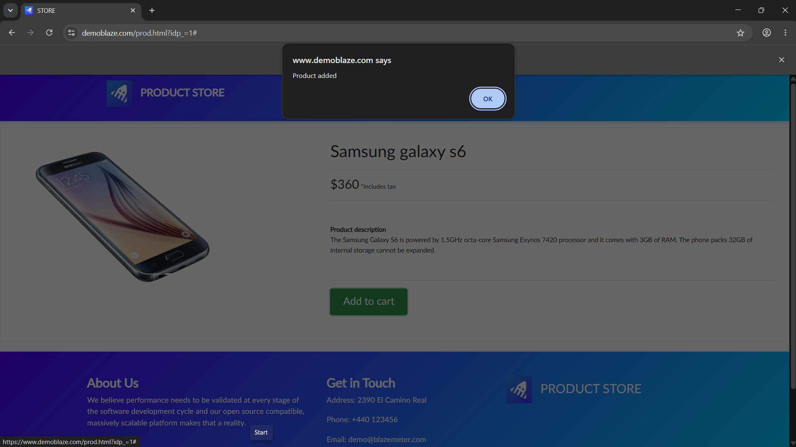
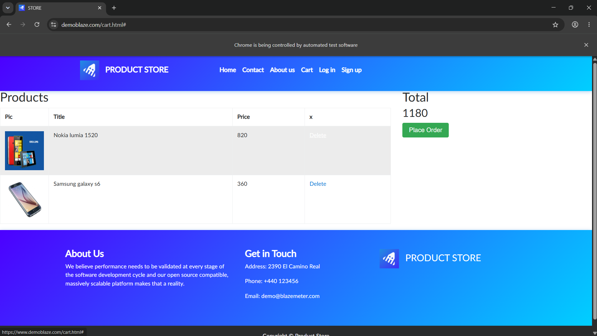
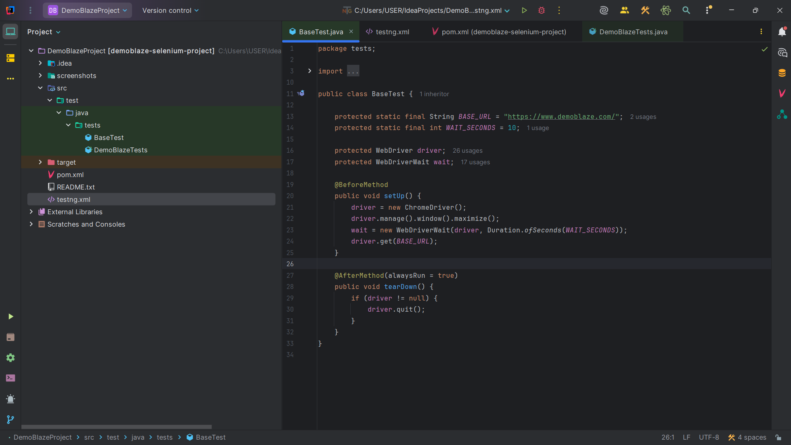
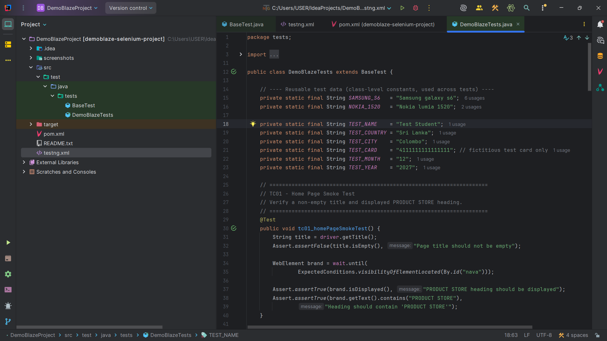
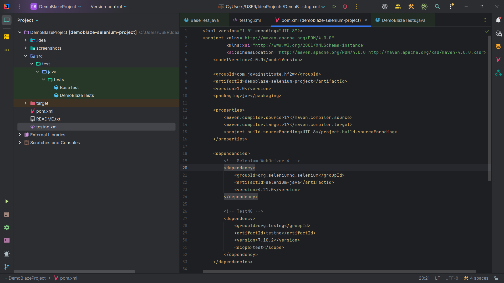
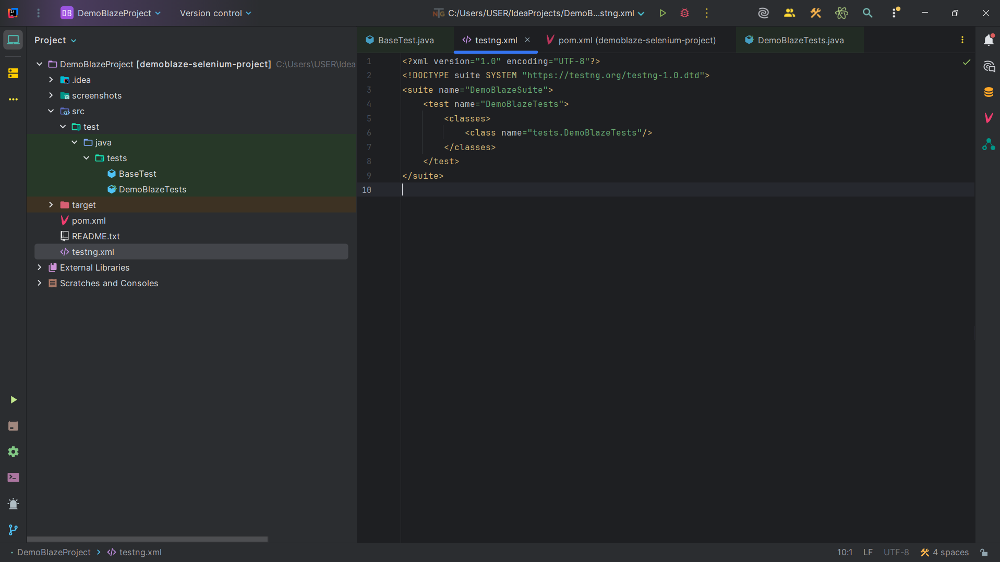
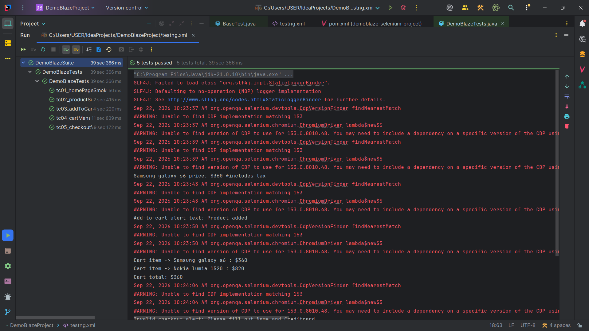
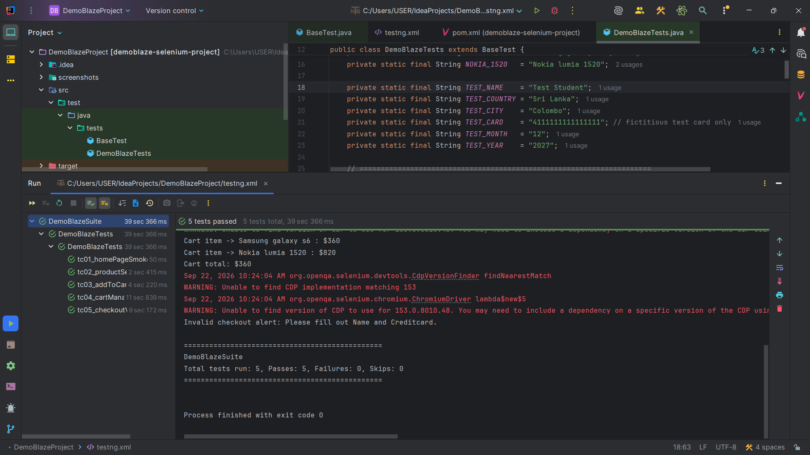
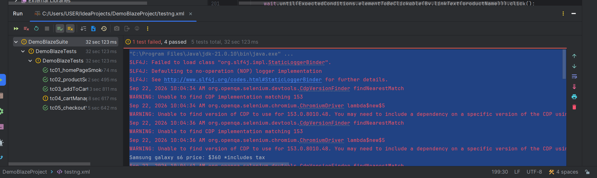
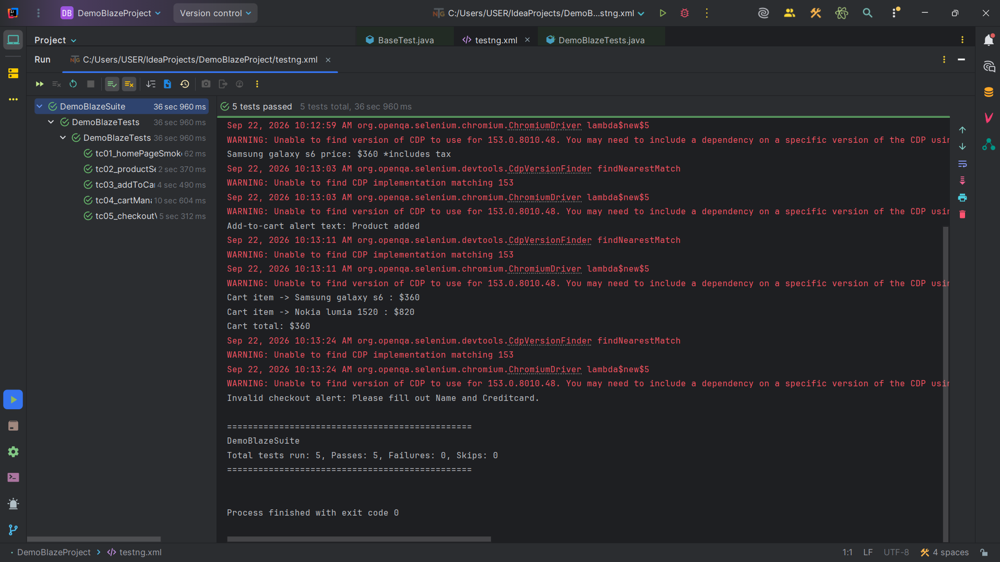

# DemoBlaze Selenium Java Automation Project

---

## 📌 Project Purpose

This project is a beginner-level automated smoke/regression test suite for the [DemoBlaze](https://www.demoblaze.com/) online store.

The automation suite covers:

- Home page smoke testing
- Product selection
- Adding products to the cart
- JavaScript alert handling
- Cart management
- Counting cart items using `findElements()` and a loop
- Removing products from the cart
- Checkout validation
- Invalid and valid checkout scenarios

---

## 📚 Technologies Used

- Java
- Apache Maven
- Selenium WebDriver
- TestNG
- Google Chrome
- IntelliJ IDEA / Eclipse

---

## 🛠️ Environment

| Technology | Version |
|---|---|
| Java JDK | 17+ |
| Apache Maven | 3.9+ |
| Selenium WebDriver | 4.21.0 |
| TestNG | 7.10.2 |
| Browser | Google Chrome (latest) |
| IDE | IntelliJ IDEA / Eclipse |

---

## 📁 Project Structure

```text
DemoBlazeProject/
│
├── pom.xml
├── testng.xml
├── README.md
│
├── screenshots/
│   ├── 03_TC03_add_to_cart_alert.png
│   ├── 04_TC04_cart_before_removal.png
│   ├── 06_code_BaseTest.png
│   ├── 07_code_DemoBlazeTests.png
│   ├── 08_code_pom.xml.png
│   ├── 09_code_testng.xml.png
│   ├── 10_TestNG_console_output_part1.png
│   ├── 11_TestNG_results_summary_5passed.png
│   ├── 12_TC04_run_pass_with_cart_log.png
│   └── 13_final_5tests_passed_run.png
│
└── src/
    └── test/
        └── java/
            └── tests/
                ├── BaseTest.java
                └── DemoBlazeTests.java
```

---

## ▶️ How to Run

### Option A — IntelliJ IDEA / Eclipse

1. Open the project as a Maven project.
2. Allow Maven to download the required dependencies.
3. Make sure Google Chrome is installed.
4. Right-click `testng.xml`.
5. Select **Run**.

### Option B — Command Line

Open a terminal in the project root directory and run:

```bash
mvn test
```

---

## 🧪 Test Cases Implemented

### TC01 — Home Page Smoke Test

Verifies that:

- The page title is not empty.
- The **PRODUCT STORE** heading is displayed.

### TC02 — Product Selection

Verifies that:

- The **Phones** category is opened.
- **Samsung galaxy s6** is selected.
- The product heading is displayed.
- The product price is printed to the console.

### TC03 — Add to Cart

Verifies that:

- **Samsung galaxy s6** is added to the cart.
- The JavaScript alert is detected.
- The alert text is printed to the console.
- The alert is accepted.

### TC04 — Cart Management

Verifies that:

- **Samsung galaxy s6** is added to the cart.
- **Nokia lumia 1520** is added to the cart.
- Cart rows are counted using `findElements()` and a loop.
- **Nokia lumia 1520** is removed.
- Exactly one cart row remains.
- The remaining product is **Samsung galaxy s6**.
- The cart total is printed to the console.

### TC05 — Checkout Validation

The test starts with a cart containing **Samsung galaxy s6**.

#### Invalid Checkout

The Purchase button is clicked with all fields empty.

The test verifies that the resulting JavaScript alert mentions the missing **Name/Card** details.

#### Valid Checkout

The form is filled with fictitious test data.

The test verifies the successful checkout message:

```text
Thank you for your purchase!
```

---

## 🔐 Fictitious Checkout Data

No real personal or payment information is used.

| Field | Test Data |
|---|---|
| Name | Test Student |
| Country | Sri Lanka |
| City | Colombo |
| Card | `4111111111111111` |
| Month | `12` |
| Year | `2027` |

---

## 📸 Test Evidence

The `screenshots/` folder contains screenshots showing the test implementation and execution results.

| | |
|---|---|
| **Add to Cart Alert**<br><br> | **Cart Before Removal**<br><br> |
| **BaseTest Implementation**<br><br> | **DemoBlaze Tests**<br><br> |
| **Maven Configuration**<br><br> | **TestNG Configuration**<br><br> |
| **TestNG Console Output**<br><br> | **Test Results — 5 Tests Passed**<br><br> |
| **TC04 Cart Test Execution**<br><br> | **Final Test Run — 5 Tests Passed**<br><br> |

---

## ⚠️ Assumptions & Known Limitations

- DemoBlaze is a public demonstration website, and its HTML structure or behavior may change without notice.
- Locators were verified against the live website at the time of development.
- If a test fails because of a changed element, the locator should be re-checked using **Right-click → Inspect**.
- The invalid checkout scenario relies on DemoBlaze's client-side validation, which displays a JavaScript alert mentioning missing Name/Card details rather than an inline form error.
- The project does not include login or registration automation because these features are outside the assignment scope.
- The tests use the guest checkout flow.

---

## Developer

**Shehani Kavindi**  
Software Engineering — Birmingham City University
**Unit:** HF2W - Software Engineering II (Software Testing, QA and Maintenance)  
**Component A:** Selenium Java Automation Project

---
